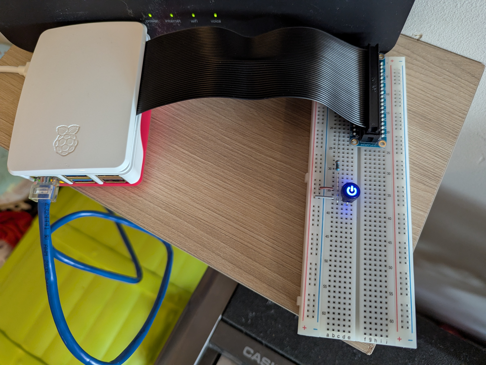

# Raspberry Pi

Pi-Hole with breadboard button that enables and disables it.
Allows people without access to the Pi to turn adverts on and off.

The service that manages the button automatically runs on startup.



## Useful commands

Button service:

```sh
sudo systemctl daemon-reload # Run when updating the service
sudo systemctl status pihole-button # Get the state of service
sudo systemctl enable pihole-button.service # Start service on boot
sudo systemctl disable pihole-button.service # Do not start service on boot
sudo systemctl start pihole-button.service # Start service now
sudo systemctl stop pihole-button.service # Stop service now
sudo systemctl restart pihole-button.service # Restart service now
```

Follow the button service's logs:

```sh
sudo journalctl -f -u pihole-button.service
```

Run the script directly:

```sh
chmod +x pihole-button.py
pihole-button.py
```
